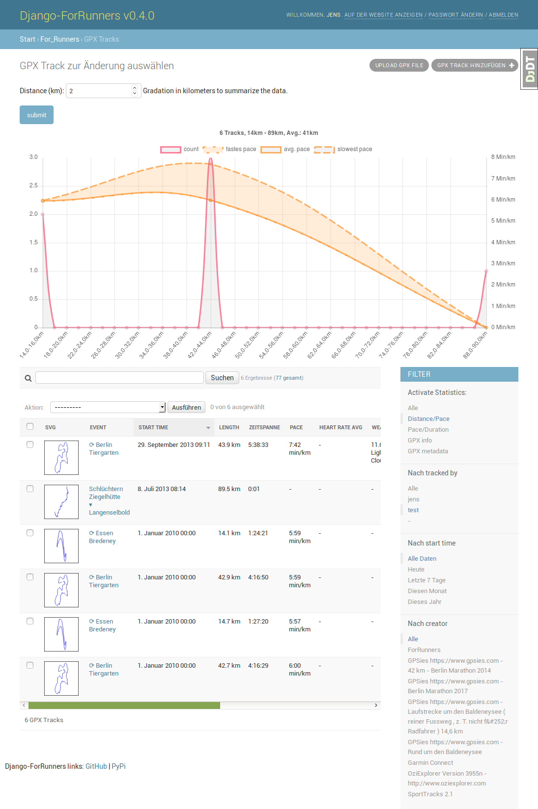

<!--
Nota bene : ce README est automatiquement généré par <https://github.com/YunoHost/apps/tree/master/tools/readme_generator>
Il NE doit PAS être modifié à la main.
-->

# django-for-runners pour YunoHost

[](https://ci-apps.yunohost.org/ci/apps/django-for-runners/)  

[](https://install-app.yunohost.org/?app=django-for-runners)

*[Lire le README dans d'autres langues.](./ALL_README.md)*

> *Ce package vous permet d’installer django-for-runners rapidement et simplement sur un serveur YunoHost.*  
> *Si vous n’avez pas YunoHost, consultez [ce guide](https://yunohost.org/install) pour savoir comment l’installer et en profiter.*

## Vue d’ensemble

[](https://github.com/YunoHost-Apps/django-for-runners_ynh/actions/workflows/tests.yml)
[](https://app.codecov.io/github/jedie/for_runners_ynh)
[](https://pypi.org/project/for_runners_ynh/)
[](https://github.com/YunoHost-Apps/django-for-runners_ynh/blob/main/pyproject.toml)
[](https://github.com/YunoHost-Apps/django-for-runners_ynh/blob/main/LICENSE)

[django-for-runners](https://github.com/jedie/django-for-runners) is a libre web-based management for your GPX tracks of your running (or other sports activity). Used [Python](https://www.python.org/)/[Django](https://www.djangoproject.com/).

Pull requests welcome ;)

This package for YunoHost used [django-yunohost-integration](https://github.com/YunoHost-Apps/django_yunohost_integration)

More screenshots are here: [jedie.github.io/tree/master/screenshots/django-for-runners](https://github.com/jedie/jedie.github.io/tree/master/screenshots/django-for-runners/README.creole)


**Version incluse :** 0.20.0~ynh2

## Captures d’écran



## Documentations et ressources

- Dépôt de code officiel de l’app : <https://github.com/jedie/django-for-runners>
- YunoHost Store : <https://apps.yunohost.org/app/django-for-runners>
- Signaler un bug : <https://github.com/YunoHost-Apps/django-for-runners_ynh/issues>

## Informations pour les développeurs

Merci de faire vos pull request sur la [branche `testing`](https://github.com/YunoHost-Apps/django-for-runners_ynh/tree/testing).

Pour essayer la branche `testing`, procédez comme suit :

```bash
sudo yunohost app install https://github.com/YunoHost-Apps/django-for-runners_ynh/tree/testing --debug
ou
sudo yunohost app upgrade django-for-runners -u https://github.com/YunoHost-Apps/django-for-runners_ynh/tree/testing --debug
```

**Plus d’infos sur le packaging d’applications :** <https://yunohost.org/packaging_apps>
