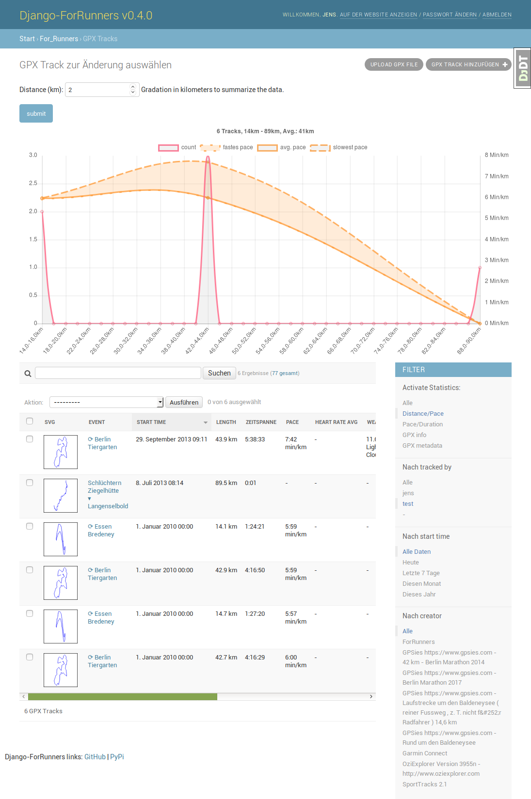

<!--
N.B.: README ini dibuat secara otomatis oleh <https://github.com/YunoHost/apps/tree/master/tools/readme_generator>
Ini TIDAK boleh diedit dengan tangan.
-->

# django-for-runners untuk YunoHost

[](https://ci-apps.yunohost.org/ci/apps/django-for-runners/)  

[](https://install-app.yunohost.org/?app=django-for-runners)

*[Baca README ini dengan bahasa yang lain.](./ALL_README.md)*

> *Paket ini memperbolehkan Anda untuk memasang django-for-runners secara cepat dan mudah pada server YunoHost.*  
> *Bila Anda tidak mempunyai YunoHost, silakan berkonsultasi dengan [panduan](https://yunohost.org/install) untuk mempelajari bagaimana untuk memasangnya.*

## Ringkasan

[](https://github.com/YunoHost-Apps/django-for-runners_ynh/actions/workflows/tests.yml)
[](https://app.codecov.io/github/jedie/for_runners_ynh)
[](https://pypi.org/project/for_runners_ynh/)
[](https://github.com/YunoHost-Apps/django-for-runners_ynh/blob/main/pyproject.toml)
[](https://github.com/YunoHost-Apps/django-for-runners_ynh/blob/main/LICENSE)

[django-for-runners](https://github.com/jedie/django-for-runners) is a libre web-based management for your GPX tracks of your running (or other sports activity). Used [Python](https://www.python.org/)/[Django](https://www.djangoproject.com/).

Pull requests welcome ;)

This package for YunoHost used [django-yunohost-integration](https://github.com/YunoHost-Apps/django_yunohost_integration)

More screenshots are here: [jedie.github.io/tree/master/screenshots/django-for-runners](https://github.com/jedie/jedie.github.io/tree/master/screenshots/django-for-runners/README.creole)


**Versi terkirim:** 0.20.0~ynh2

## Tangkapan Layar



## Dokumentasi dan sumber daya

- Depot kode aplikasi hulu: <https://github.com/jedie/django-for-runners>
- Gudang YunoHost: <https://apps.yunohost.org/app/django-for-runners>
- Laporkan bug: <https://github.com/YunoHost-Apps/django-for-runners_ynh/issues>

## Info developer

Silakan kirim pull request ke [`testing` branch](https://github.com/YunoHost-Apps/django-for-runners_ynh/tree/testing).

Untuk mencoba branch `testing`, silakan dilanjutkan seperti:

```bash
sudo yunohost app install https://github.com/YunoHost-Apps/django-for-runners_ynh/tree/testing --debug
atau
sudo yunohost app upgrade django-for-runners -u https://github.com/YunoHost-Apps/django-for-runners_ynh/tree/testing --debug
```

**Info lebih lanjut mengenai pemaketan aplikasi:** <https://yunohost.org/packaging_apps>
